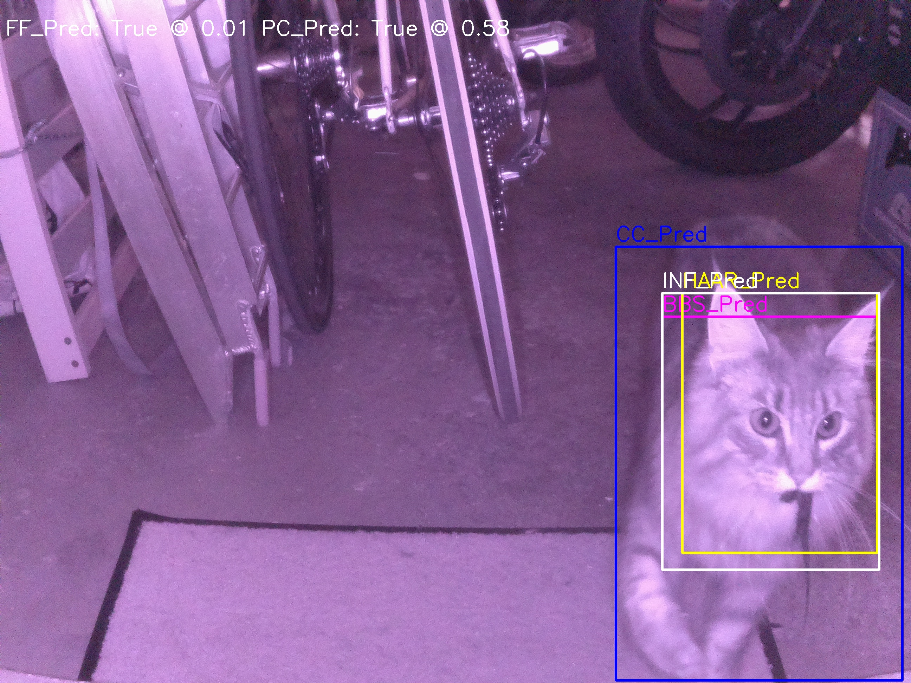

# Introduction
If you own a cat that has the freedom to go outside, then you probably are familiar with the issue of your feline bringing home prey. This leads to a clean up effort that one wants to avoid!
This project aims to perform Cat Prey Detection with Deep Learning on any cat in any environment. For a brief and light intro in what it does, check out the [Raspberry Pi blog post](https://www.raspberrypi.org/blog/deep-learning-cat-prey-detector/) about it. The idea is that you can use the output of this system to trigger your catflap such that it locks out your cat, if it wants to enter with prey.



The script can connect to your [Sure Petcare Catflap](https://www.surepetcare.com/en-us/pet-doors/microchip-cat-flap-connect), either by logging directly into your account through the Surepy module ([surepy on GitHub](https://github.com/benleb/surepy)) or via Home Assistant ([hass.io](https://hass.io)), or both. It reads settings from `config.py` and environment variables — first attempts Surepy, then falls back to Home Assistant.

# Related work
This isn't the first approach at solving the mentioned problem! There have been other equally (if not better) valid approaches such as the [Catcierge](https://github.com/JoakimSoderberg/catcierge) which analyzes the silhouette of the cat a very recent approach of the [AI powered Catflap](https://www.theverge.com/tldr/2019/6/30/19102430/amazon-engineer-ai-powered-catflap-prey-ben-hamm).
The difference of this project however is that it aims to solve *general* cat-prey detection through a vision based approach. Meaning that this should work for any cat! 

# How to use the Code
The code is meant to run on a RPI4 with the [IR JoyIt Camera](https://joy-it.net/de/products/rb-camera-IR_PRO) attached. If you have knowledge regarding Keras, you can also run the models on your own, as the .h5 files can be found in the /models directory (check the input shapes, as they can vary). Nonetheless, I will explain the prerequisites to run this project on the RPI4 with the attached infrared camera:

- Download the whole project and transfer it to your RPI. Make sure to place the folder in your home directory such that its path matches: `/home/pi/CatPreyAnalyzer` (check your `PYTHONPATH=/home/pi/tensorflow1/models/research:/home/pi/tensorflow1/models/research/slim`).

- Install the tensorflow object detection API as explained in [EdjeElectronics Repositoy](https://github.com/EdjeElectronics/TensorFlow-Object-Detection-on-the-Raspberry-Pi), which provides other excellent RPI object detection information.

- Create a Telegram Bot via the [Telegram Bot API](https://core.telegram.org/bots). After doing so, your bot will receive a **BOT_TOKEN**, write this down. Next you will have to get your **CHAT_ID** by calling [https://api.telegram.org/bot<YourBOTToken>/getUpdates](https://api.telegram.org/bot<YourBOTToken>/getUpdates) in your browser, as explained in the [StackOverflow guide on obtaining a Telegram group chat ID](https://stackoverflow.com/questions/32423837/telegram-bot-how-to-get-a-group-chat-id).

- Create an `.env` file (use `.env.example` as a template) in the root directory and fill in your secrets. This will be sourced when running `cascade.py`. The syntax of `.env` files supported by python-dotenv is similar to that of Bash. Take a look at [python-dotenv](https://pypi.org/project/python-dotenv/).

Edit `config.py` between the lines `### START EDITABLE VARS ###` and `### END EDITABLE VARS ###`. Set your preferences, camera URLs, video resolutions and the horizontal/vertical flipping options. After that, you can start `cascade.py` like this:

```bash
./cascade.py --camera_id cam2 --log info
```
- You can also specify a preferred backend for unlocking/locking the catflap if you configured the correct credentials for both. Select it by using the optional attribute `--backend`, which can be set to either 'surepy' or 'ha'. **NOTE**: if the chosen backend doesn’t work, there’s **no fall-back** to the other one, an error will be shown instead!

- If you provide 'CAMERA_SSH_USERNAME', 'CAMERA_REMOTE_COMMAND' and 'CAMERA_SSH_KEY_FILE' in `config.py`, the script will restart your camera through SSH after 'MAX_FRAME_FAILURES' was reached and capture process was killed.

Here's a full help menu of the main script cascade.py:

```bash
$ ./cascade.py --help
usage: cascade.py [-h] [-l {info,warning,error,critical,debug}] [-c CAMERA_ID] [-b {surepy,ha}]

        Cat Prey Analyzer - Smart Cat Flap Monitor

        This tool uses camera input and machine learning to detect
        whether a cat is bringing prey, managing catflap control,
        either through the python surepy module or through homeassistant.
        It communicates with the user (and can be controlled through) the telegram messaging app.

options:
  -h, --help            show this help message and exit
  -l {info,warning,error,critical,debug}, --log {info,warning,error,critical,debug}
                        Set the logging level (default=info).
  -c CAMERA_ID, --camera_id CAMERA_ID
                        Camera ID as defined in config.py (e.g., cam1, cam2). Takes 'default' if none specified.
  -b {surepy,ha}, --backend {surepy,ha}
                        Force use of one of the following backends for catflap unlocking/locking:
                                      - surepy (use surepy module)
                                      - ha (use homeassistant REST/Webhook)

        Edit 'config.py' to reflect your setup and tweak the values for better performance.
        Create a [hidden] '.env' file containing your secrets from the '.env.example' template,
        see 'https://pypi.org/project/python-dotenv/'.
```

By following all these steps, you should now be greeted by your Telegram Bot at startup:


The system is now running and the available bot commands are shown. You can access those anytime by typing `/help` in your bot conversation. Be aware that you need patience at startup, as the models take up to 5 min to load — they are substantial in size.

# Catflap Lock/Unlock Backends
For these two following steps you need to get your Sure Petcare's <catflap ID> by logging in to [https://surepetcare.io/OnboardingLetsStart](https://surepetcare.io/OnboardingLetsStart), going to products and clicking on your catflap. Note the ID from the URL you see in your browser, it'll look something like this: `https://surepetcare.io/device/<YourID>/details`.

# Configuring Surepy
You need to install the [dev branch of surepy](https://github.com/benleb/surepy/tree/dev) as a module (see requirements.txt and python documentation), then set your catflap ID and credentials (either email AND password, the surepy token, or both) in the `.env` file.

# Configuring Home Assistant
You need two URLs for controlling the catflap through homeassistant, a REST API URL for getting the current catflap locking status and a WEBHOOK URL for controlling it.

For the REST API, you need to generate a token as shown in [this article](https://developers.home-assistant.io/docs/api/rest/).

Put your URL and access token (without the 'Bearer ' part) into your `.env` file. The URL will look something like this (replace 'sensor.cat_flap' with the actual name of your sensor in hassio), for example:

```http
http://192.168.1.24:8123/api/states/sensor.cat_flap
```

The webhook triggered automation for controlling the catflap looks like this (replace 12345678 with your catflap ID):

```yaml
alias: CatPreyAnalyser Lock/Unlock
description: "Webhook for controlling the catflap from CatPreyAnalyzer"
triggers:
  - webhook_id: LockUnlockCatFlap_fromCatPreyAnalyzer
    allowed_methods:
      - POST
    local_only: true
    trigger: webhook
actions:
  - data:
      lock_state: "{{ trigger.json.ha_state }}"
      flap_id: "12345678"
    action: sureha.set_lock_state
```

# NOTE on cv2 frame capture method
I added GStreamer as another method of capturing frames, since I had problems on my camera with garbled images captured through openCV VideoCapture. GStreamer provides more reliable frame capture. For this to work, you have to install the debian system package of OpenCV, opencv-python from PyPI does not have GStreamer support. If you want to use this, you have to do the following steps:

- Install GStreamer and plugins

```bash
sudo apt update
sudo apt install gstreamer1.0-tools \
  gstreamer1.0-plugins-base \
  gstreamer1.0-plugins-good \
  gstreamer1.0-plugins-bad \
  gstreamer1.0-plugins-ugly \
  gstreamer1.0-libav
```

- Remove pip-installed OpenCV if present

```bash
pip uninstall opencv-python opencv-contrib-python
```

- Install OpenCV from apt

```bash
sudo apt install python3-opencv
```

This will install OpenCV system-wide (and you will use import cv2 as usual).

- You also have to downgrade NumPy to <2.0

```bash
pip install "numpy<2"
```

If you need both NumPy 2 and OpenCV with GStreamer support, you must build OpenCV from source, making sure that NumPy 2.x headers are found at build time and that GStreamer is enabled. This is not recommended for most users.

- Edit `cascade.py` and change the following import statement:

from this:

```python
from camera_class import Camera
```

to this:

```python
from camera_class_GStreamer import Camera
```

# A word of caution
This project uses deeplearning! Contrary to popular belief DL is **not** black magic (altough close to 😎)! The network perceives image data differently than us humans. It "sees" more abstractly than us. This means a cat in the image lives as an abstract blob deep within the layers of the network. Thus there are going to be instances where the system will produce absurdly wrong statements such as:

 
 
  This can happen and the reason why is maths... so you have to be aware of it. If this fascinates you as much as it does me and you want a deeper understanding, check out [the deeplearning book](http://www.deeplearningbook.org/)!
 
Further this project is based on transfer learning and has had a **very** small training set of only 150 prey images, sampled from the internet and a custom data-gathering network (more info in ```/readme_images/Semesterthesis_Smart_Catflap.pdf```). It works amazingly well *for this small amount of Data*, yet you will realize that there are still a lot of false positives. I am working on a way that we could all collaborate and upload the prey images of our cats, such that we can further train the models and result in a **much** stronger classifier. 

And check the issues section for known issues regarding this project. If you encounter something new, don't hesitate to flag it! For the interested reader, a TLDR of my thesis is continued below.

# Architecture
In this section we will discuss the the most important architectural points of the project.

### Cascade of Neural Nets ###
This project utilises a cascade of Convolutional Neural Networks (CNN) to process images and infer about the Prey/No_Prey state of a cat image. The reason why it uses a cascade is simple: CNN's need data to learn their task, the amount of data is related to the complexity of the problem. For general cat prey detection, a NN would need to first learn what a cat is in general, and find out how their snouts differ with and without prey. This turns out to be quite complex for a machine to learn and we simply don't have enough data of cats with prey (only 150 images to be exact). This is why we use a cascade to break up the complex problem into smaller substages:

- First detect if there is a cat or not. There exists a lot of data on this problem and a lot of complete solutions such for example any COCO trained Object detector such as for example [Tensorflows COCO trained MobileNetV2](https://github.com/tensorflow/models/blob/master/research/deeplab/g3doc/model_zoo.md). We call it the CatFinder stage which utilises the mentioned Tensorflow object detection API and runs the Tensorflow pretrained MobileNetV2 and soley aims to detect a cat in the image.

- Second we detect the snout of the cat within the image section of the first stage. This is done combination of different Computer Vision (CV) techniques such as HAAR-Cascade and a self trained CNN (CNN-BB + FF).

- Lastly we classify the snout-cropped image of the cat with a self trained CNN based on the VGG16 architecture. It was only trained with ~150 Prey-Snout-Images gathered from the internet and personal images. This is the data-critical section; we can find more than enough images of cats but only very few images of cats with prey in their snout. Obviously the tasks complexity of identifying prey in a cropped image of the snout is simpler than classifying so on a full image, hence the extra steps of the cascade.

Here is a brief overview of the cascade:


As depicted in the image, there are four resulting paths that can be taken which yield different runtimes. On an off the shelf Raspberry Pi 4 the runtimes areas follows:

- P1: 507 ms
- P2: 3743 ms
- P3: 2035 ms
- P4: 5481 ms


### Processing Queue ###
Now the runtime numbers are quite high, which is why we use a dynamically adapting queue to adjust the framerate of the system. This part is built specifically for the RPI and its camera system. It is a multithreading process where the camera runs on an own thread and the cascade on a seperate thread. The camera fills a concurrent queue while the cascade pops the queue at a dynamic rate. Sounds fancy and complicated, but it isn't:


### Cummuli Points ###
As we are evaluating over multiple images that shall make up an event, we must have the policy, We chose: *A cat must prove that it has no prey*. The cat has to accumulate trust-points. The more points the more we trust our classification, as our threshold value is 0.5 (1: Prey, 0: No_Prey) points above 0.5 count negatively and points below 0.5 count positively towards the trust-points aka cummuli-points. 


As is revealed in the Results section, we chose a cummuli-treshold of 2.93. Meaning that we classify the cat to have proven that it has no prey as soon as it reaches 2.93 cummuli-points.


# Results

As a cat returns with prey roughly only 3% of the time, we are dealing with an imbalanced problem. To evaluate such problems we can use a Precision-Recall curve, where the "no_skill" threshold is depicted by the dashed line, for further reading on how this works check out this [Scikit Article](https://scikit-learn.org/stable/auto_examples/model_selection/plot_precision_recall.html#:~:text=The%20precision%2Drecall%20curve%20shows,a%20low%20false%20negative%20rate.). Next to it the ROC-curve is depicted, as it is a very common method to evaluate NN models, yet more suited for a balanced evaluation. 

As you can see in the ROC plot (using ROC because explaination is more intuitive), we chose the threshold point of 2.93 cummuli points which yields a True Positive Ratio (TPR) of ~93% while showing a False Positive Ratio (FPR) of ~28%. This means that 93% of all prey cases will be cought correctly while the cat is falsely accused of entering with prey 28% of times that it actually does not have prey.


Here is the simple confusion matrix (shown for data transparency reasons), with the decison threshold set at 2.93 cummuli points. The confusion matrix has been evaluated on 57 events which results in ~855 images.


And here we have a less technical "proof" that the cascade actually does what it is supposed to do. On the top are independent images of my cat without prey, while on the bottom the same images have a photoshopped mouse in its snout. You can see that the photoshopped images significantly alter the prediction value of the network.


